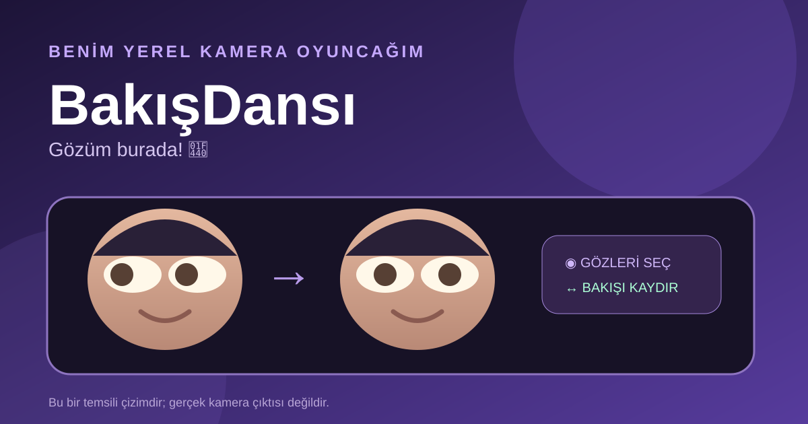

# BakışDansı 👀



Aklıma bu geldi: Ben görüntülü konuşurken bazen ekrana değil, yandaki notuma bakıyorum. Fotoğrafta gözüm başka yerde kalıyor. Ben de gözümü küçük küçük kaydıran bir araç yaptım. Biraz oyun gibi! Ama işe de yarıyor.

Ben kameramı açabiliyorum. Ben bir fotoğraf da seçebiliyorum. Kameramı açmak istemezsem çizilmiş örnek yüzü açıyorum. Ben sol ve sağ gözümün ortasına tıklıyorum. Sonra bakışımı sağa, sola, yukarı veya aşağı kaydırıyorum. İstersem göz alanını büyütüyorum. **Ekrana bak** ve **Komik bakış** düğmelerini de ekledim. Beğenirsem o anki kareyi PNG olarak indiriyorum.

Ben kamerayı sadece bu sayfada kullanıyorum. Ben mikrofon izni istemiyorum. Ben görüntümü bir sunucuya yollamıyorum. Ben kamera kapat düğmesine basınca kamera akışını durduruyorum. Ben kendi yüzümün fotoğrafını repoya koymadım. Yukarıdaki resim gerçek kamera resmi değil, **temsili çizim**.

## Ben nasıl açıyorum?

Ben bu klasörde bir terminal açıyorum. Python varsa şunu yazıyorum:

```bash
python3 -m http.server 8000 --bind 127.0.0.1
```

Sonra `http://127.0.0.1:8000` adresine gidiyorum. **Kameramı aç** düğmesine ben basıyorum. Tarayıcı benden izin isterse ben seçiyorum. Kamera açılmazsa fotoğraf veya örnek çizimle devam edebiliyorum.

## Ben nasıl yaptım?

Ben görüntüyü tarayıcıdaki tuvale çiziyorum. Gözlerin çevresinde küçük iki oval alan seçiyorum. O alanın içindeki pikselleri yumuşakça kaydırıyorum. Kenardaki pikselleri yerinde bırakıyorum. Böylece keskin bir kare izim olmuyor. Ben görüntümü cihazımda işliyorum. Ayrı bir paket veya hesap istemiyorum.

Benim girdim kamera ya da fotoğraf. Benim çıktım düzenlenmiş PNG. Mesela ben gözüm hafif soldayken **Ekrana bak** düğmesine basıyorum. Sonra göz halkaları yanlış yerdeyse ben onları tıklayıp düzeltiyorum. Kontrol bende.

## Benim sınırım

Ben henüz gözleri kendi kendime bulamıyorum. Benim gözlerime iki kez tıklamam gerekiyor. Ben sadece küçük bakış değişimlerinde daha iyi sonuç alıyorum. Başımı çok çevirdiysem gerçekçi görünmeyebilir. Bu sürüm başka uygulamalara canlı sanal kamera vermiyor. Ben yalnızca bu sayfada ön izleme ve fotoğraf çıktısı veriyorum. Ben ileride göz yerini otomatik bulmayı ve canlı sanal kamera desteğini araştırmak istiyorum; bunları şimdi olmuş gibi söylemiyorum.

## Ben neyi denedim?

Ben `node test.mjs` çalıştırdım. **9 kontrol geçti.** Ben piksel kaymasını, görüntü kenarını, sıfır ayarı ve yanlış boyu kontrol ettim. Ben tarayıcıda çizilmiş yüzü açtım, **Ekrana bak** ayarını gördüm ve indirme düğmesine bastım. Tarayıcı bana “indirdim” dedi. Ben gerçek kamera iznini bu çalışmada doğrulayamadım; o yüzden gerçek kamera görüntüsüyle kesin çalıştı demiyorum.

## Ben bu fikri bugün nereden çıkardım?

Ben **26 Eylül 2026** günü listelere baktım. [GitHub Trending günlük listesinde](https://github.com/trending?since=daily) gördüğüm 15 proje içinde [paperclipai/paperclip](https://github.com/paperclipai/paperclip) **2.589 yeni yıldız** ile en yüksek artıştaydı. Bu, gördüğüm listenin sırası. Bütün GitHub için kesin birincilik demiyorum. Ben oradan küçük işleri kolaylaştıran araç fikrini aldım.

Ben [Trends24 dünya geneli X listesinin](https://trends24.in/) 26 Eylül 2026 saat 16:54 UTC görüntüsünde **#YouManiacSeriesEP5** etiketini 1. sırada gördüm. Bu, X'in resmi sayı sayfası değil; üçüncü tarafın o andaki listesi. Ben [Reddit r/popular / Today / Top görünümünde](https://www.reddit.com/r/popular/top/?t=day) baba, kızı ve torununun fotoğrafını anlatan [bu paylaşımı](https://www.reddit.com/r/MadeMeSmile/comments/1wq8kj3/man_shares_a_photo_of_him_and_his_daughter_and_a/) ilk sırada gördüm. Bu da gördüğüm sayfanın sırası; tüm Reddit'in tek konusu demiyorum.

Bu üç konu benim kamera fikrimle tam birleşmiyor. Ben onları zorla bağlamadım. Bugünkü aracı senin istediğin eğlenceli kamera işi için hazırladım.
